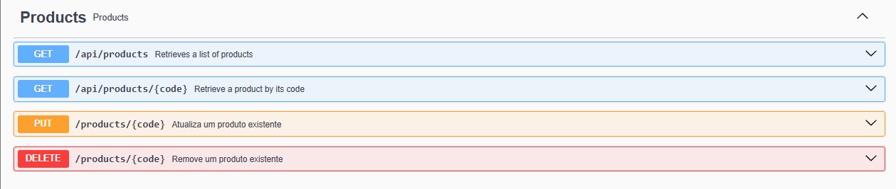
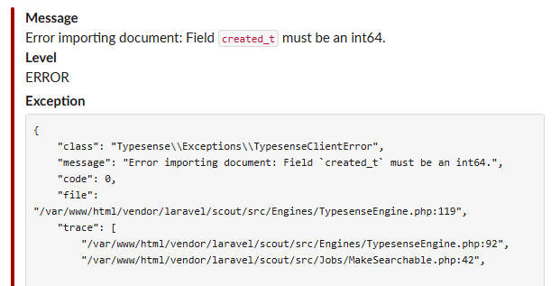
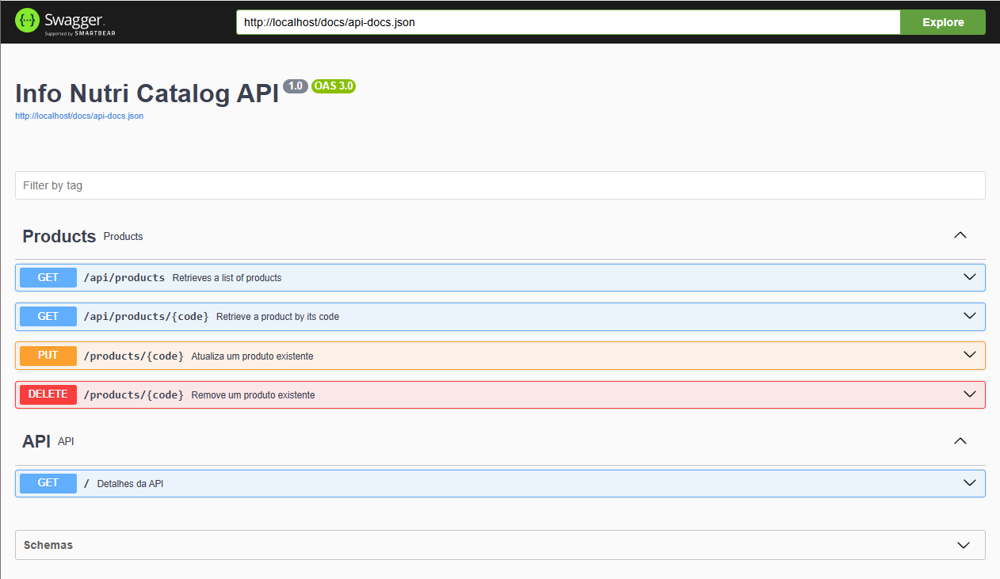

<h1 align="center">
    Info Nutri Catalog API
</h1>

>  This is a challenge by [Coodesh](https://coodesh.com/)

## :boat: Sobre o projeto

Nesse projeto foi desenvolvida uma API para disponibilização de dados nutricionais de diversos produtos alimentícios utilizando os dados do projeto [Open Food Facts](https://br.openfoodfacts.org/data), que é um banco de dados aberto com informação nutricional. Primeiramente implementou-se um script para importar os dados para a Base de Dados com a versão mais recente do [Open Food Facts](https://br.openfoodfacts.org/data), e depois outro para importação diária de novos produtos publicados. Também foi implementado um sistema de alerta por Slack para situações de ocorrência de falhas nas importações. 

Mais detalhes sobre o sistema estão descritos nos próximos tópicos.

## :hammer: Tecnologias:
- **[PHP 8.3](https://www.php.net)**
- **[Laravel](https://laravel.com/)**
- **[Sail](https://github.com/laravel/sail)**
- **[MongoDB](https://www.mysql.com/)**
- **[L5-Swagger](https://github.com/DarkaOnLine/L5-Swagger)**

## :rocket: Como rodar esse projeto

Se você estiver usando Windows, vai precisar do WSL para rodar esse projeto de forma prática. Para isso, você pode instalá-lo seguindo o seguinte [tutorial](https://learn.microsoft.com/pt-br/windows/wsl/install). Também será necessário uma distribuição linux para utilizar o WSL. Recomendo o Ubuntu que pode ser baixando na própria Microsoft Store no [link](https://apps.microsoft.com/store/detail/ubuntu/9PDXGNCFSCZV).
Depois, vai precisar do Docker, o qual a versão de Windows pode ser encontrada [aqui](https://docs.docker.com/desktop/install/windows-install/).
Então, clone o projeto dentro do WSL, vá para pasta dele e execute o comando:

```
docker run --rm \
    -u "$(id -u):$(id -g)" \
    -v "$(pwd):/var/www/html" \
    -w /var/www/html \
    laravelsail/php83-composer:latest \
    composer install --ignore-platform-reqs
```
Este comando usa um pequeno contêiner Docker contendo PHP e Composer para instalar as dependências do aplicativo.

Para iniciar todos os contêineres Docker definidos no docker-compose.ymlarquivo do seu aplicativo:

```
./vendor/bin/sail up
```
Para iniciar todos os contêineres do Docker em segundo plano, você pode iniciar o Sail no modo "desanexado":
```
./vendor/bin/sail up -d
```
Agora precisamos configurar as variáveis ambientes. Crie o arquivo .env:

```
cp .env.example .env
```

Agora precisamos configurar as variáveis ambientes para realização de testes. Crie o arquivo .env.testing:

```
cp .env.example .env.testing
```

Altere o valor de "APP_ENV" para "testing" no arquivo ".env.testing".

Crie as chaves de segurança da aplicação:

    `./vendor/bin/sail artisan key:generate`

Informe a string de conexão com o MongoDB no arquivo .env:

```
MONGODB_URI="mongodb+srv://<username>:<password>@<cluster>.mongodb.net/<dbname>?retryWrites=true&w=majority"
MONGODB_DATABASE="<laravel_app>"
```

Informe a url do webhook do slack:

```
LOG_SLACK_WEBHOOK_URL=https://hooks.slack.com/services/...
```

Execute as migrações:

    `./vendor/bin/sail artisan migrate`

Agora será necessário carregar as informações dos produtos no sistema:

```
./vendor/bin/sail artisan import:products
```

Depois que os contêineres do aplicativo forem iniciados, você poderá acessar o projeto no seu cliente REST em: http://localhost .

Para parar todos os contêineres, você pode simplesmente pressionar Control + C para parar a execução do contêiner. Ou, se os contêineres estiverem rodando em segundo plano, você pode usar o stopcomando:
```
./vendor/bin/sail stop
```

Para iniciar os processos de worker configurados para o ambiente:
```
./vendor/bin/sail artisan queue:work
```

Para executar o agendador de tarefas:
```
./vendor/bin/sail artisan schedule:work
```
## :computer: Features

### Products CRUD

Deve ser possível adicionar, visualizar, editar e remover registros referente a Produtos (Products).
<h4 align="center">
    
</h4>


### Importação diária de produtos
Utilizando o recurso de Task Scheduling do Laravel, foi possível implementar uma rotina de importação de novos produtos. Para que ela funcione no servidor, basta adicionar o seguinte comando no cron do servidor:
```
* * * * * cd /caminho-ate-o-projeto && php artisan schedule:run >> /dev/null 2>&1
```

O horário da importação foi implementado em uma variável de ambiente no arquivo .ENV do projeto. Dessa forma, é possível alterar o horário padrão de 00:30 horas para outro sem a necessidade de alteração do código do sistema.
```
.env

IMPORT_TIME=00:30
```

### Sistema de alerta de falhas na importação
Na ocorrência de alguma falha nas importações, o sistema irá disparar uma mensagem para Slack.
<h4 align="center">
    
</h4>

## :top: Informações adicionais e boas práticas
### Documentação da API com Open API 3.0 e Swagger
Esta API foi documentada seguindo os preceitos do Open API 3.0. Através do [Swagger-PHP](https://zircote.github.io/swagger-php/), foi possível gerar um arquivo yaml com todas as definições dos endpoints da API, e disponibilizado de forma visual através do caminho /swagger. Dessa forma é possível verificar todos endpoints e especificações dos possíveis parâmetros, além de testá-los. 
<h4 align="center">
    
</h4>

## :raising_hand: Como contribuir para o projeto

- Faça um **fork** do projeto;
- Crie uma nova branch com as suas alterações: `git checkout -b my-feature`
- Salve as alterações e crie uma mensagem de commit contando o que você fez:`git commit -m "feature: My new feature"`
- Envie as suas alterações: `git push origin my-feature`

> Caso tenha alguma dúvida confira este [guia de como contribuir no GitHub](https://github.com/firstcontributions/first-contributions)

## :pencil: Licença

Este projeto esta sobe a licença MIT. Veja a [LICENÇA](https://opensource.org/licenses/MIT) para saber mais.

Feito com ❤️ por Edeson Ribeiro Silva 👋🏽 [Entre em contato!](https://www.linkedin.com/in/edribeirodeveloper/)
